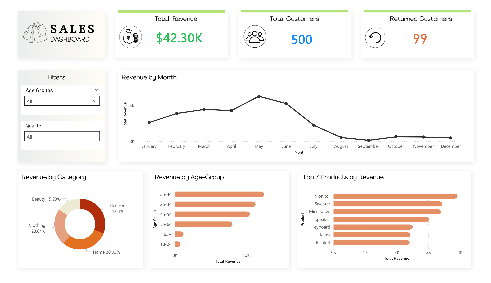

# Sales Dashboard

---

## The Problem

Sales data is only useful when it tells a story. Raw transaction records don't answer questions like *"who is actually buying from us?"*, *"when do we peak — and why do we drop off?"*, or *"which products are quietly carrying the business?"* This dashboard was built to answer exactly those questions.

---

## What I Built

An end-to-end sales analytics dashboard covering **500 customers**, **$42.30K in total revenue**, and a **19.8% customer return rate**, all filterable by age group and quarter so any stakeholder can slice the data to their specific question.

---

## The Story the Data Tells

**There's a clear seasonal peak in May, then a cliff.**
Revenue climbs steadily from January through May, hits its highest point, then drops sharply and plateaus at a lower level from August through December. That's not a gradual cool-down — it's a structural shift worth investigating. Is it a product cycle? A marketing push that runs out? This dashboard makes the pattern impossible to ignore.

**The 35–44 age group is the most valuable customer segment.**
They outspend every other age group by a noticeable margin, followed closely by 25–34. Meanwhile, the 18–24 and 65+ segments are nearly flat. For the marketing team, this is a prioritization decision waiting to happen.

**Electronics leads revenue by category — but Home is closer than it looks.**
Electronics takes 31.04%, but Home (30.03%) and Clothing (23.64%) are not far behind. Beauty at 15.29% rounds it out. This near-even split across four categories signals a diversified revenue base, which is healthy — but also means no single category can be neglected.

**The top product is a Monitor, and the list mixes electronics with apparel.**
Monitor, Sweater, Microwave, Speaker, Keyboard, Jeans, Blanket — a cross-category top 7 that reflects the broader category balance and points to specific SKUs worth protecting with inventory and promotional priority.

---

## Filters Built In

The dashboard includes dynamic filtering by **Age Group** and **Quarter**, allowing revenue trends, category breakdowns, and product rankings to be viewed through any demographic or time-period lens — without needing a second report.

---

## Tool Stack
- Microsoft Excel (Data Cleaning & Data Analysis)
- ChatGPT (Dataset generation)
- Power BI (Data Visualization)

## What This Project Demonstrates
- Translating raw sales data into a narrative, not just a collection of charts
- Designing for a non-technical audience — every visual answers a plain-English question
- Identifying anomalies (the post-May drop) that would prompt real business action
- Demographic segmentation as a lens for both marketing and product strategy
  
